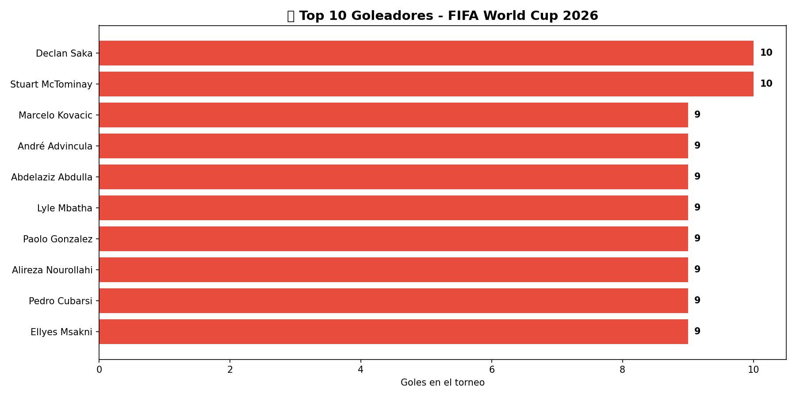
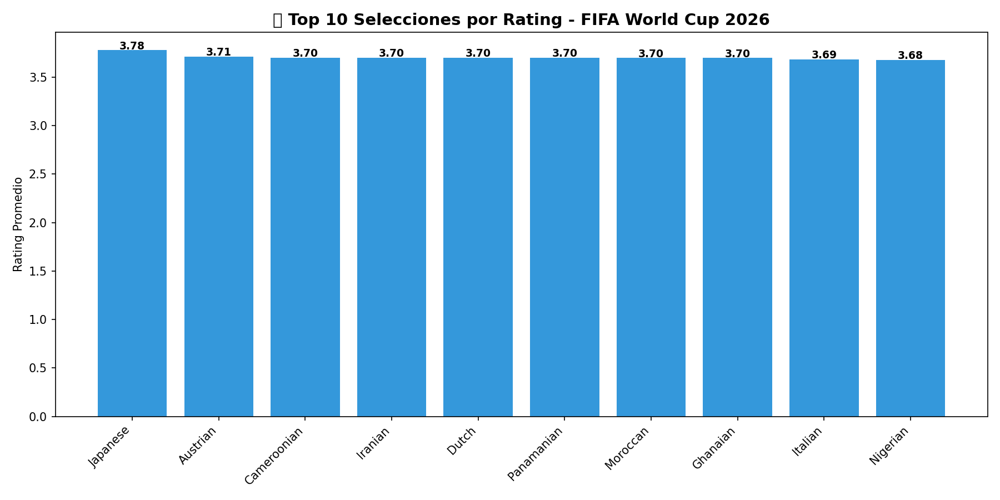
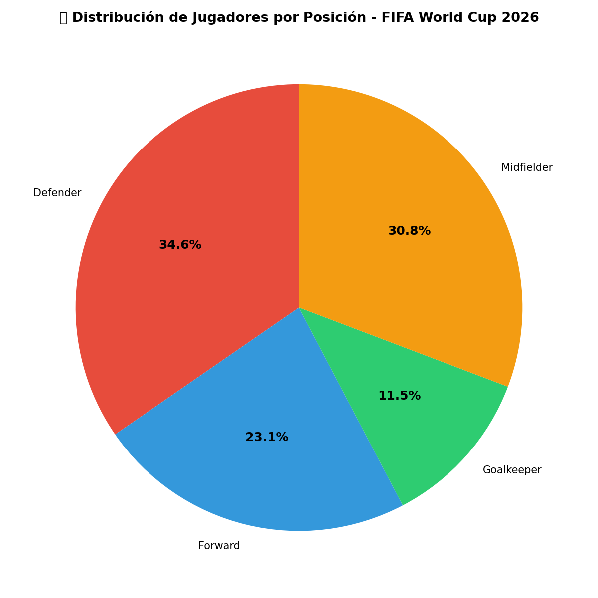
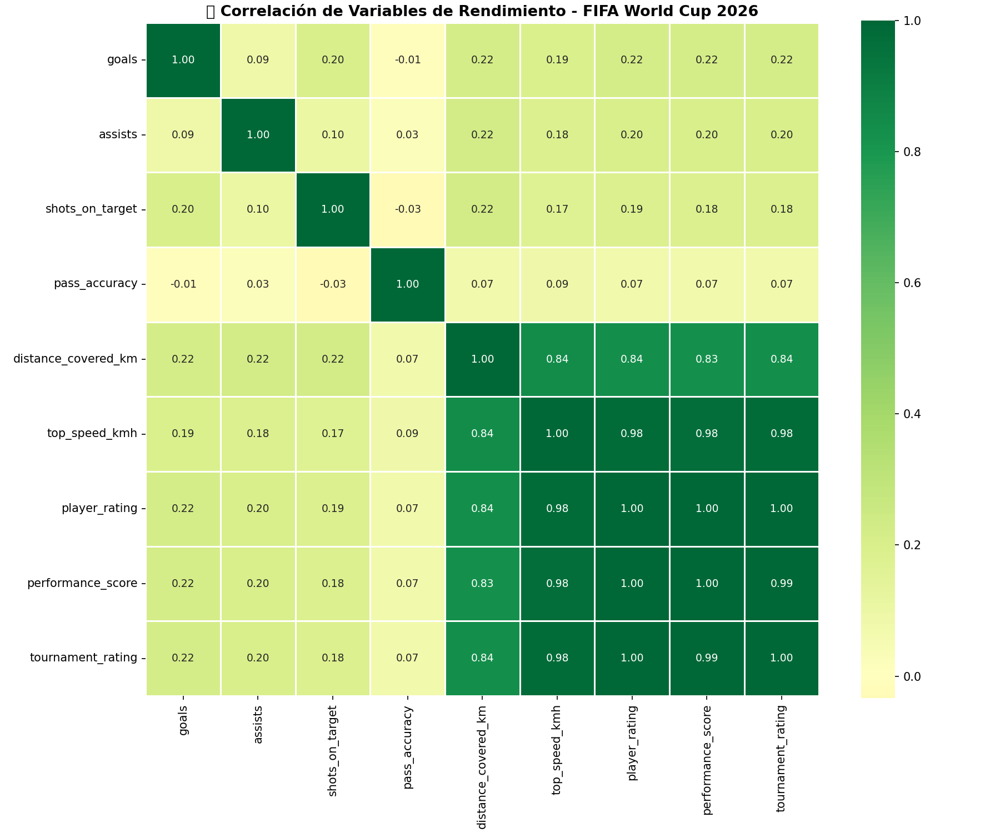
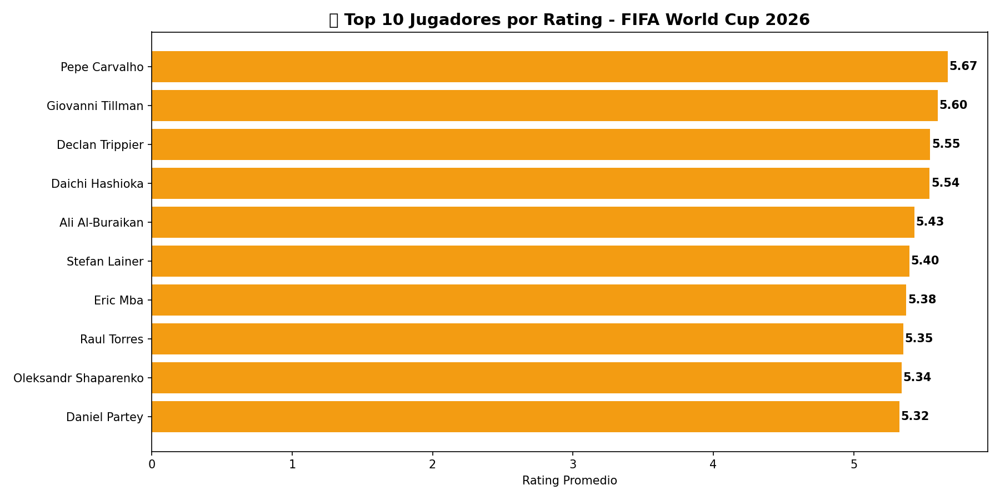

# ⚽ FIFA World Cup 2026 - Player Performance Analysis 🏆

## 📋 Descripción
Análisis completo del rendimiento de 1,245 jugadores en 1,050 partidos del FIFA World Cup 2026 usando SQL, Python, Excel, Power BI y Tableau.

## 🛠️ Herramientas utilizadas
- **SQL (SQLite)** — Extracción y consultas de datos
- **Python** — Limpieza y visualización (pandas, matplotlib, seaborn)
- **Excel** — Tablas y gráficos dinámicos
- **Power BI** — Dashboard interactivo con mapa y KPIs
- **Tableau Public** — Dashboard interactivo con 3 visualizaciones

## 📊 Hallazgos principales
- Declan Saka y Stuart McTominay lideran con 10 goles
- André Advincula (Perú) 🇵🇪 entre los top 10 goleadores con 9 goles
- Paolo Gonzalez (Perú) 🇵🇪 también con 9 goles
- Qatar lidera en goles por selección con 95
- Japón lidera en rating promedio con 3.78
- Velocidad máxima correlaciona 0.98 con rating del torneo

## 📁 Dataset
- **Fuente:** [Kaggle - FIFA World Cup 2026 Player Performance](https://www.kaggle.com)
- **Registros:** 54,600
- **Variables:** 75 columnas

## 📸 Visualizaciones

